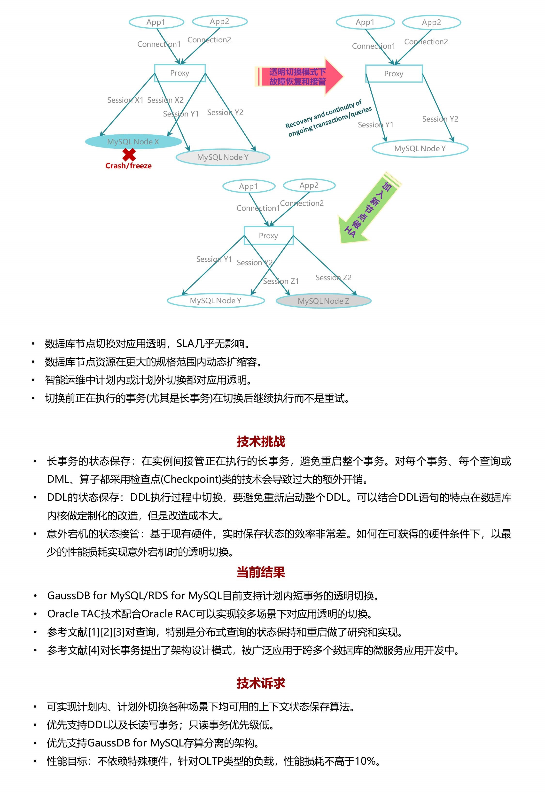

# 难题2：【数据库】 应用透明的高效事务切换机制
核心价值：云数据库服务Serverless化，动态扩缩容和节点切换对应用透明。

参考文献

[1] Query suspend and resume, http://db.cs.duke.edu/papers/2007-SIGMOD-cbby-qresume.pdf 

[2] Spanner: Becoming a SQL system, https://research.google/pubs/pub46103/

[3] POLARIS: The distributed SQL engine in Azure Synapse, https://www.vldb.org/pvldb/vol13/p3204-saborit.pdf 

[4] SAGAS, https://www.cs.cornell.edu/andru/cs711/2002fa/reading/sagas.pdf 