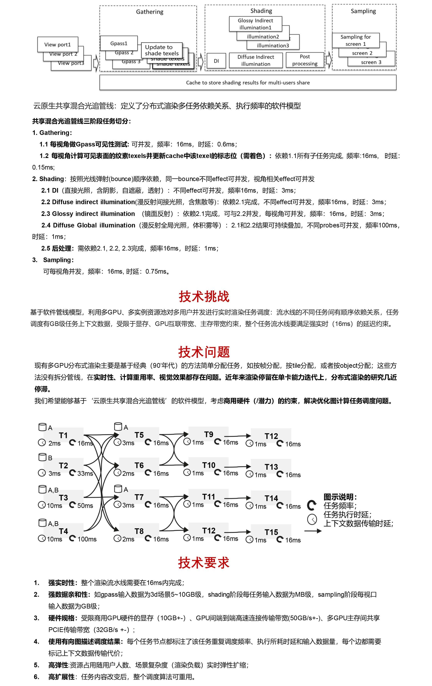

# 难题3：【媒体】 云原生实时渲染多GPU分布式任务调度问题

核心价值：发挥云上GPU集群算力优势，将多个关联渲染子任务以流水线方式分布式调度到多GPU上并发处理，从而最大化渲染效率，最小化每用户渲染成本。

参考文献：

[1] Li, Jung-qing, and Yun-qi Han. “A hybrid multi-objective artificial bee colony algorithm for flexible task scheduling rproblems in cloud computing systems.”Cluster Computing 23.4. (2020): 2483-2499

[2] Wald, Ingo, Philipp Slusallek, and CastenBenthin. “Interactive distributed ay tracing of highly complex models.”Eurogpraphics Workshop on Rendering Techniques. Springer, Vienna, 2001.