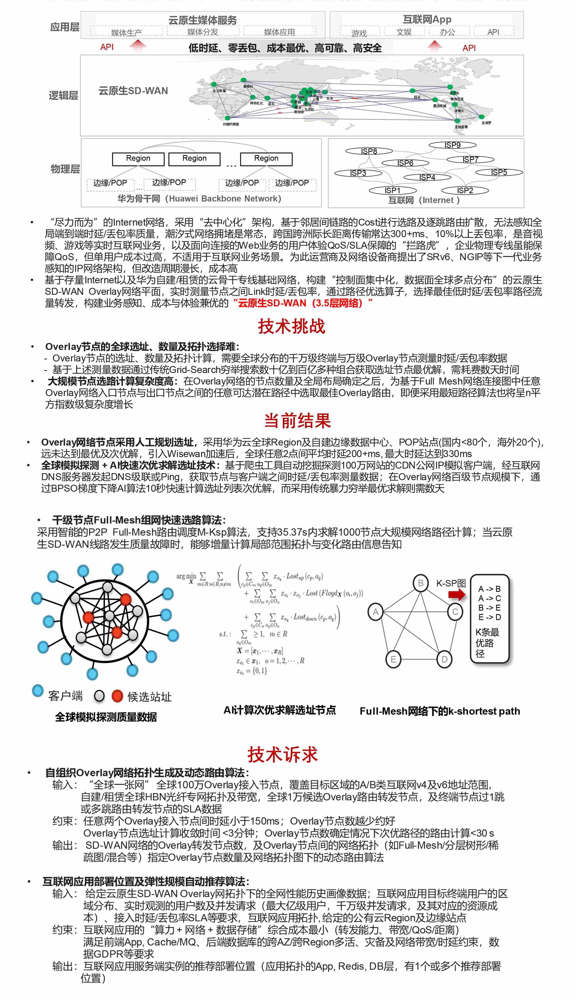

# 难题4：【网络】“云原生SD-WAN”节点选址及路由算法

核心价值： 降低云服务商“全球一张网”广域网络互联成本，提供面向租户的弹性按需、QoS保障的广域网连接。

参考文献：

[1] Xu, Hong, and Baochun Li. "A general and practical datacenter selection framework for cloud services." 2012 IEEE Fifth International Conference on Cloud Computing. IEEE, 2012.

[2] Narayana, Srinivas, et al. "Joint server selection and routing for geo-replicated services." 2013 IEEE/ACM 6th International Conference on Utility and Cloud Computing. IEEE, 2013.

[3] E. L. Lawler. A procedure for computing the K best solutions to discrete optimization problems
 and its application to the shortest path problem. Management Science 18:401–405, 1972. 