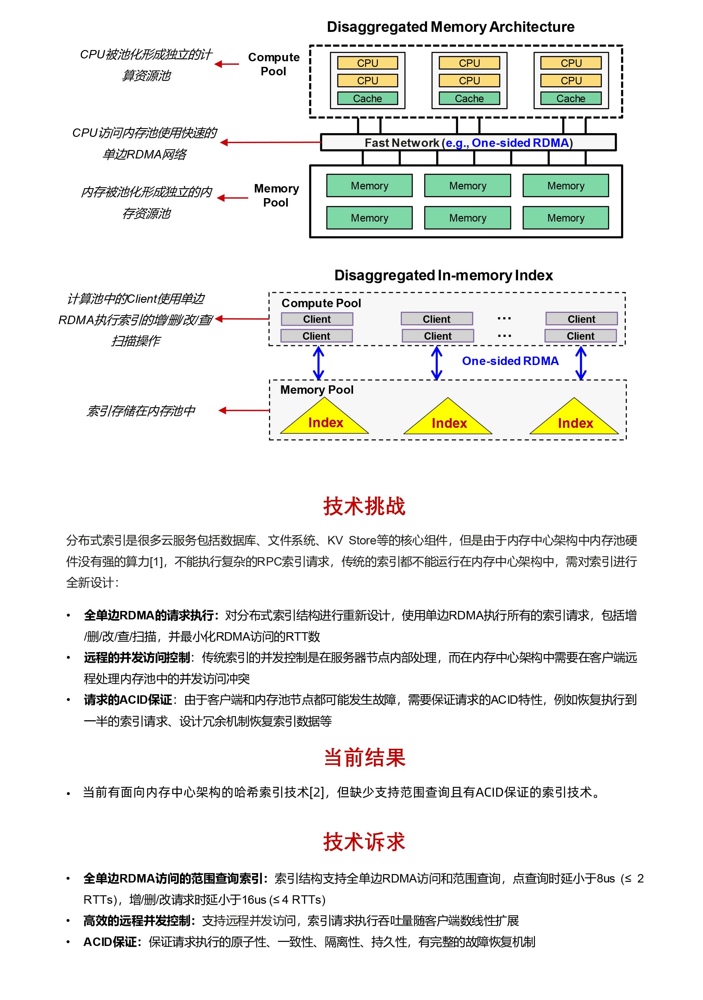

# 难题5：【存储】 CPU/内存解耦架构下提升分布式存储、文件及数据库性能的分布式索引技术

核心价值：以内存为中心硬件架构下的分布式索引软件实现机制，最大化算力与内存共享带来的弹性能力与内存资源利用率，从而实现文件系统、数据库、Key-Value存储等云服务的性能提升与成本优化。

参考文献：

[1] Yizhou Shan, et al. "LegoOS: A disseminated, distributed OS for hardware resource disaggregation", in OSDI'2018.

[2] Pengfei Zuo, et al. "One-sided RDMA-conscious extendible hashing for disaggregated memory", in USENIX ATC'2021.